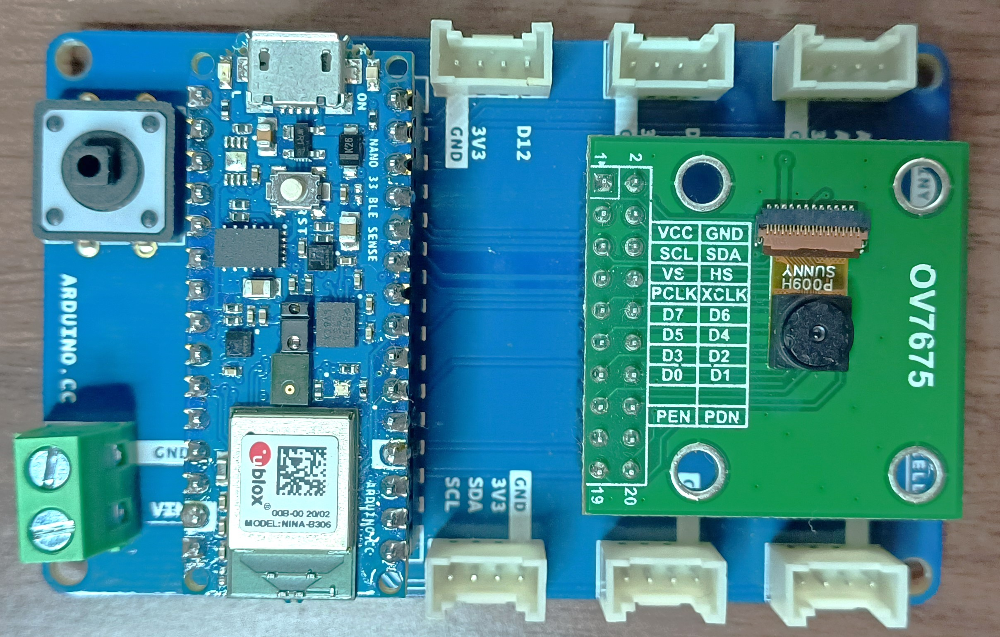
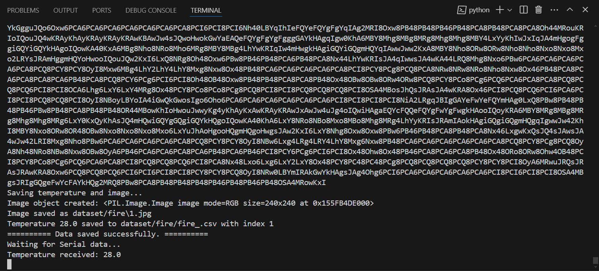
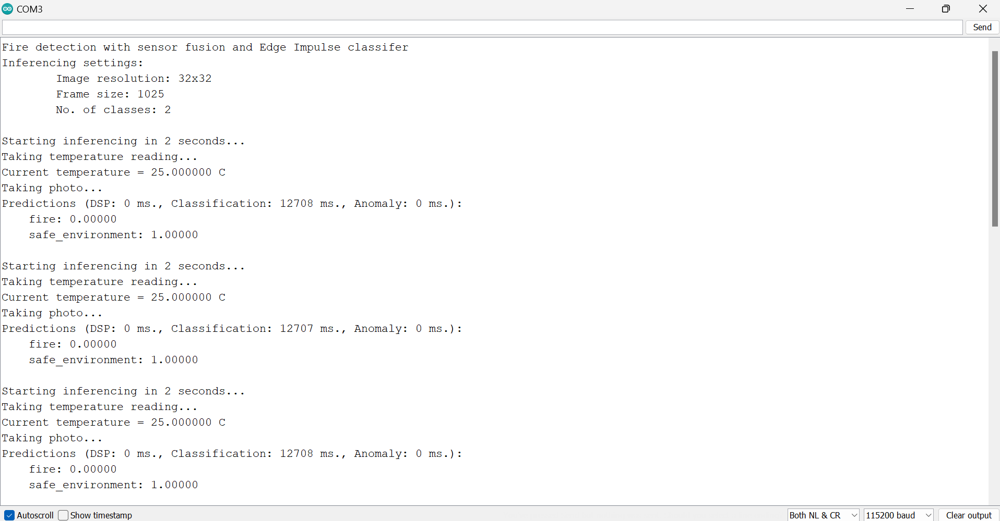

# Detecting fires using sensor fusion and TinyML

This repository demonstrates sensor fusion by training a Machine Learning model to detect fires using both image and environmental (temperature) data. A custom multi-input Convolutional Neural Network (CNN) model is used to classify if there is a fire or not using both image and temperature data. To achieve this, [tensor slicing](https://www.tensorflow.org/guide/tensor_slicing) technique is utilized to work with sub-sections of tensors. Each input to the model consists of both an image and a corresponding scalar value (temperature). The model's input tensor is sliced into an image and temperature tensor. The outputs from these two tensors are then combined and processed further to produce an output (classification of the various classes). Tensor slicing technique is advantageous in this case as well because Edge Impulse does [not support multi-input models](https://forum.edgeimpulse.com/t/could-not-work-with-multi-input-tflite-model/7216) at this time. Later, the [Edge Impulse](https://edgeimpulse.com/) platform is used to deploy the sensor fusion model.


For demonstration, the [Arduino TinyML Kit](https://store.arduino.cc/products/arduino-tiny-machine-learning-kit) has been used to obtain the training data and also run inference. This TinyML Kit has an [Arduino Nano 33 BLE Sense](https://store-usa.arduino.cc/products/arduino-nano-33-ble-sense) and it features a more powerful processor, the nRF52840 from Nordic Semiconductors, and a 32-bit ARM Cortex-M4 CPU running at 64 MHz. This allows us to make larger programs than with the Arduino Uno (it has 1MB of program memory, flash, and this is 32 times bigger), and with a lot more variables (the RAM is 128 times bigger, 256KB). The Arduino Nano 33 BLE Sense also has onboard sensors for movement, acceleration, rotation, barometric pressure, sound, gesture, proximity, color, and light intensity. In addition, the kit also includes an OV7675 camera module and this makes it easy to develop and deploy image processing applications!



## Quick start

Ensure you have the [Arduino IDE](https://www.arduino.cc/en/software) installed together with the ```HTS221``` and the ```OV767X``` libraries (they can be downloaded and installed using the [library manager](https://docs.arduino.cc/software/ide-v1/tutorials/installing-libraries/)). Afterwards, install the Arduino library [ei-fire_detection_sensor_fusion-arduino-1.0.11.zip](Edge_Impulse_Arduino_library/ei-fire_detection_sensor_fusion-arduino-1.0.11.zip) . In fact, this is the sensor fusion model deployed as an Arduino library and we will be making use of custom Edge Impulse functions for sampling images and inference. In [33_BLE_Sense_get_image_and_temperature.ino](33_BLE_Sense_get_image_and_temperature/33_BLE_Sense_get_image_and_temperature.ino), I used Edge Impulse functions from the open-source [Arduino Nano 33 BLE firmware](https://github.com/edgeimpulse/firmware-arduino-nano-33-ble-sense/blob/master/src/sensors/ei_camera.cpp) and tweaked the camera example to get an image and send it as base64 encoded.

Clone the repository using Git or download it as a zip file:
```
git clone https://github.com/SolomonGithu/Arduino_Nano_33_BLE_Sense_fire_detection_using_sensor_fusion.git
```

Open the Arduino sketch [33_BLE_Sense_get_image_and_temperature.ino](33_BLE_Sense_get_image_and_temperature/33_BLE_Sense_get_image_and_temperature.ino) and upload it to an Arduino Nano 33 BLE Sense that is connected to an OV7675 camera module. Note the COM port of the Arduino 33 BLE Sense board after uploading the sketch. Once the code has been uploaded the Arduino board will start sampling data and it is at this point that we need to place the board in the use case environment. Do not open the Serial Monitor when running the Python script since it will prevent the script access to the Serial port!

Next you can use a terminal or Command Prompt (CMD) to install the required Python libraries with the command:
```
pip install -r requirements.txt
```

Open the Python script [read_and_save_serial_data.py](read_and_save_serial_data.py) and replace the ```SERIAL_PORT``` value with the COM port of your Arduino Nano 33 BLE Sense board. If the Arduino board is sampling "normal/safe" environment data, you can set the variable ```dataset_class``` to ```"safe_environment"```, and this will make the images and temperature csv file to be put in a ```safe_environment``` folder. Similarly, if you are sampling an image and temperature of a fire environment, set the variable ```dataset_class``` to ```"fire"``` and this will make the fire images and temperature csv file to be put in a ```fire``` folder. With the Arduino board connected to the computer, run the Python script with the command:
```
python read_and_save_serial_data.py
```
The Python script will automatically process the serial data, save photos as JPG, and store temperature values in a CSV file. The images are numerically numbered, and their file names are also put in the CSV file, the same row as the temperature recorded at the moment the photo was taken. The number of times the Python script repeats this operation is controlled by the variable ```number_of_samples_to_collect```.



## Training and deployment

Once the dataset has been created, the sensor fusion model is trained with the [fire_detection_sensor_fusion_model_training_and_deployment_with_EI_python_sdk.ipynb](notebook/fire_detection_sensor_fusion_model_training_and_deployment_with_EI_python_sdk.ipynb) notebook. The model is then profiled using the Edge Impulse [Python SDK](https://docs.edgeimpulse.com/docs/tools/edge-impulse-python-sdk) and this enables us to get RAM, ROM and inference times of our model on a wide range of hardware from MCUs, CPUs, GPUs and AI accelerated boards, incredibly fascinating! When the model profiling is completed, we can then go to the Edge Impulse project (a project's API key is used with the Python SDK) and deploy the model to a wide range of hardware of [supported edge devices](https://docs.edgeimpulse.com/docs/edge-ai-hardware/edge-ai-hardware) and also as a library (C++, Arduino, DRP-AI, IAR, Particle, OpenMV, CMSIS-PACK for STM32, WebAssembly package). For this project, I used the Edge Impulse platform to deploy the model as an [Arduino library](https://docs.edgeimpulse.com/docs/run-inference/arduino-library). This packages all of the signal processing blocks, configuration and learning blocks up into a single package and we can include this package in sketches to run the pipeline locally.

The deployed Arduino library can be found in the folder [Edge_Impulse_deployment](Edge_Impulse_deployment/). I included this library in the Arduino sketch [33_BLE_Sense_Inference_code_using_Edge_Impulse.ino](33_BLE_Sense_Inference_code_using_Edge_Impulse/33_BLE_Sense_Inference_code_using_Edge_Impulse.ino) to run continuous inference. In the sketch, the code captures an image and records the current temperature. The data are then processed and passed to a classifier that returns the predictions for each class. Afterwards, the code checks the prediction scores of each class and turns the RGB led to red or green based on the results.


